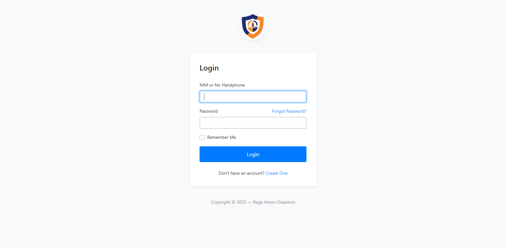
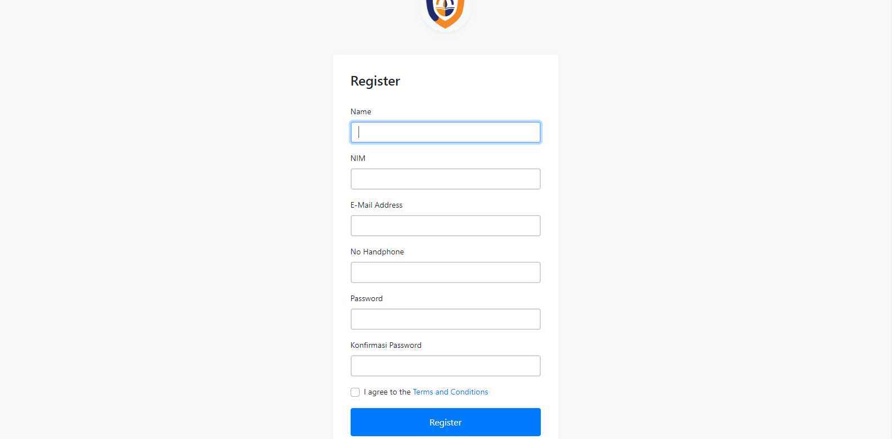

<p align="center"></p>

<h1 align="center">
   <a href="https://github.com/RegaAnton/Login_Page" target="_blank" align="center">
      Login Page
   </a>
</h1>

<p align="center">Menggunakan Bootstrap 5 sebagai Frontend</p>




## Introduction 🚀

Welcome to the repository for our custom login page! This frontend code is designed to provide a seamless and responsive user authentication experience. Utilizing Bootstrap 4.3.1, we've crafted a stylish interface that adapts to any device, ensuring that users can log in from anywhere, at any time.

The login form is intuitive, asking for either a NIM (student registration number) or a mobile phone number, followed by the password. It includes features such as input validation feedback. Additionally, users who have yet to create an account can navigate to the registration page with ease.

## Installation ⚒️

Installing and running Sneat is super easy, please Follow below steps and you will be ready to rock 🤘

- Open the terminal in your root directory.

- Clone Project

```bash
git clone https://github.com/RegaAnton/Login_Page
```

- Use the following command to install the composer

```bash
cd Login_Page
```
